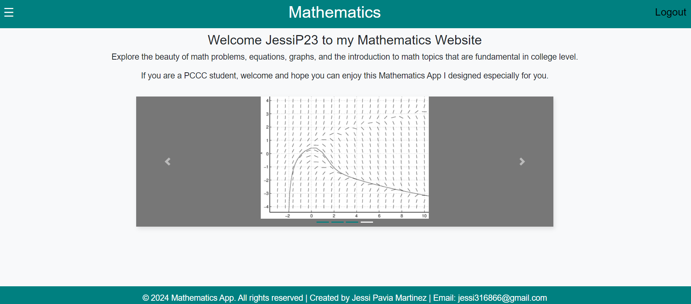
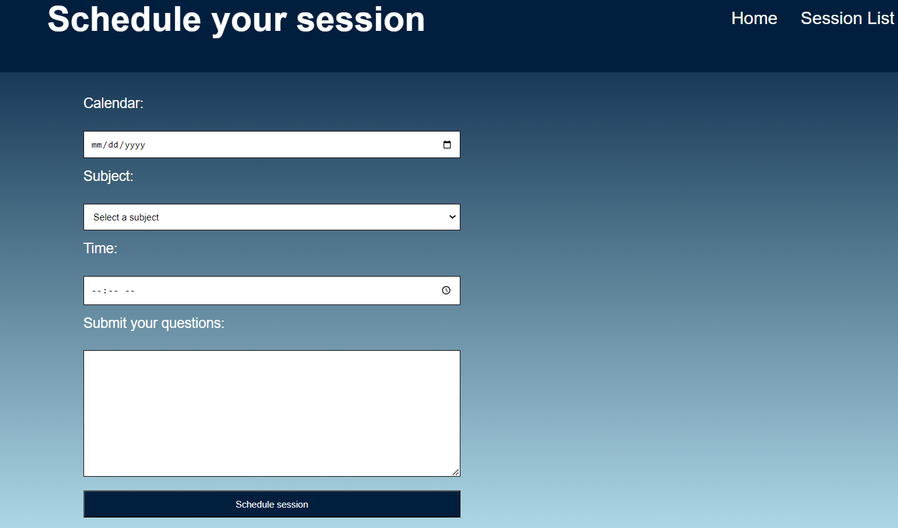

<h1>To run app locally: </h1>
<ul>
    <li>Git clone https://github.com/JessiP23/math-app-vercel.git</li>
    <li>Move inside the backend 
    directory by using a terminal.</li>
    <li>Run the command <strong>python manage.py runserver</strong></li>
</ul>

